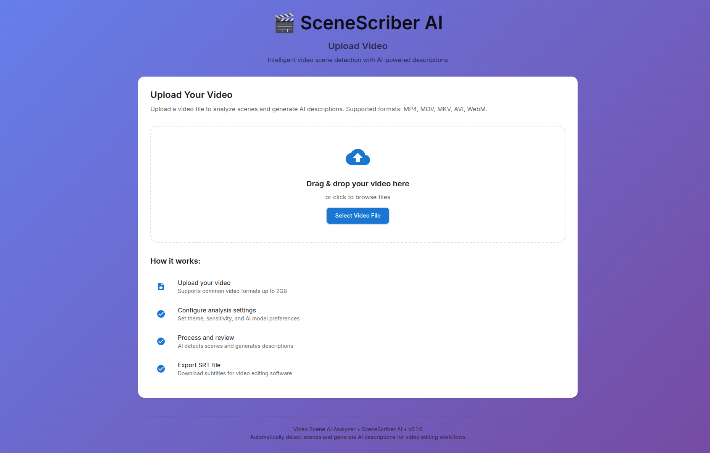
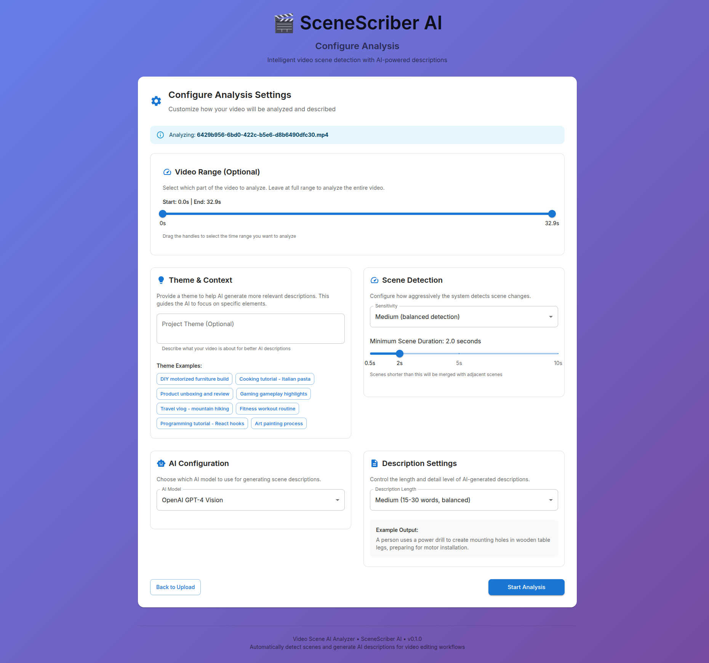
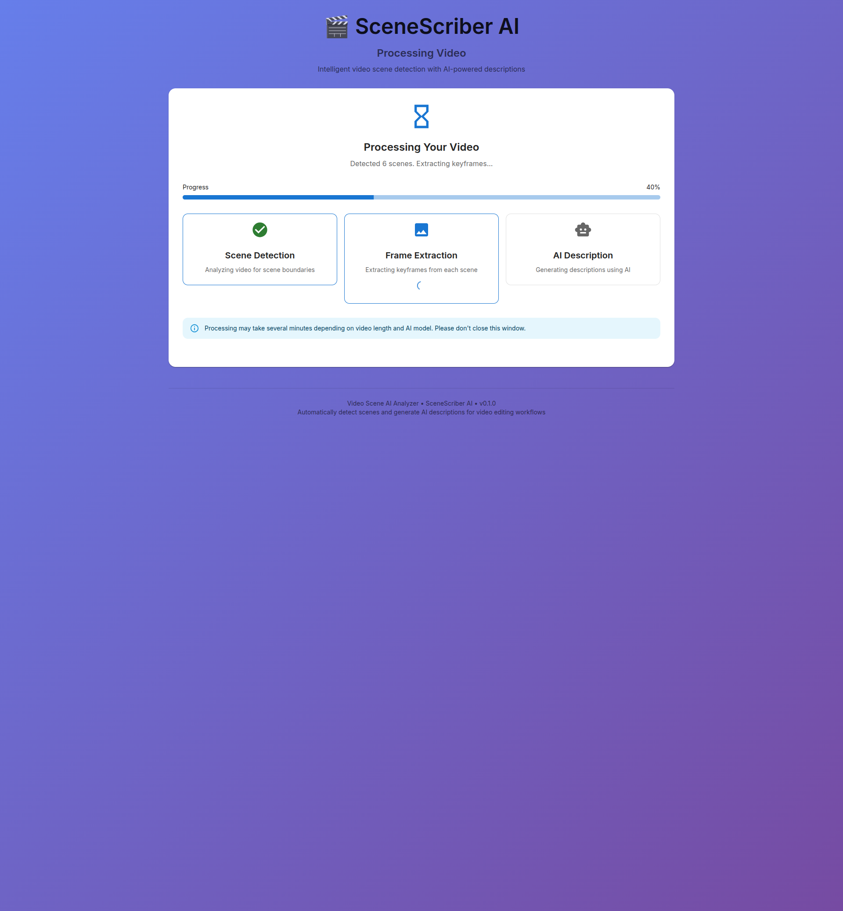
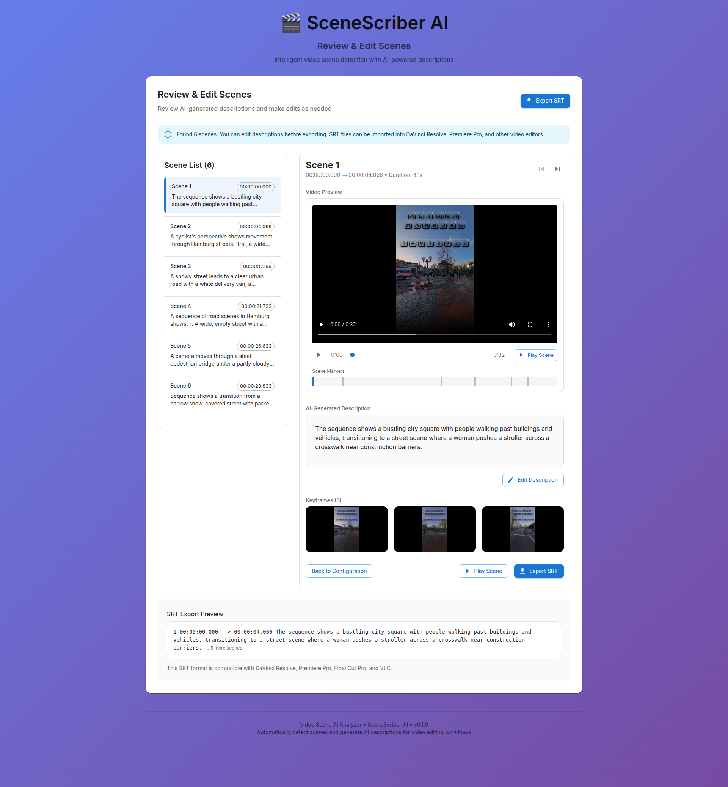
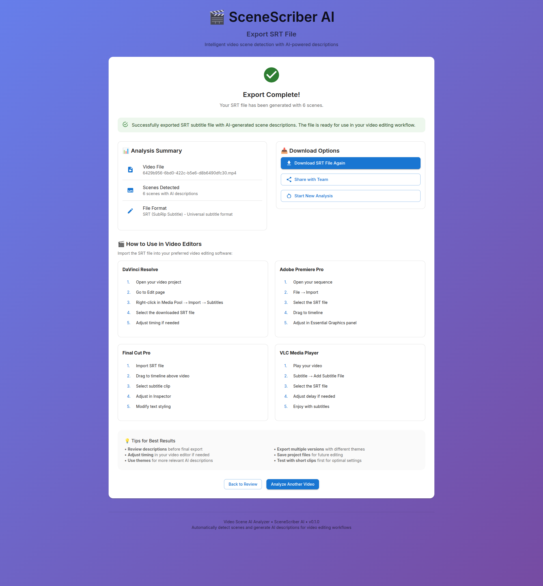

# 🎬 SceneScriber AI - Video Scene Analyzer

An intelligent video analysis tool that automatically detects scene cuts, generates AI-powered descriptions based on visuals (no audio), user-defined themes, and exports SRT caption files for video editing workflows.

## ✨ Key Features

- **Automatic Scene Detection**: Detects scene boundaries using visual analysis (FFmpeg-based histogram comparison) - **no audio analysis**
- **AI-Powered Descriptions**: Multiple AI options:
  - **Cloud AI**: GPT-4o (OpenAI), Claude 3 (Anthropic), Gemini (Google)
  - **Local AI**: LLaVA (Transformers), Ollama models (llava, bakllava, etc.) - 100% offline & free
- **Theme Integration**: Tailor descriptions to specific project themes (DIY, cooking, gaming, tutorials, etc.)
- **SRT Export**: Exports to standard SubRip subtitle format compatible with DaVinci Resolve, Premiere Pro, etc.
- **Interactive Review**: Edit and refine AI-generated descriptions before export
- **Video Preview**: Built-in player with scene markers and timeline navigation
- **Modern Web Interface**: Clean, responsive React frontend with Material-UI

## 🚀 Quick Start

### Prerequisites
- Python 3.9+ (tested with 3.12)
- Node.js 18+
- FFmpeg (for video processing) - **REQUIRED**

### Easy Setup (Recommended)

```bash
# Using Makefile (most comprehensive)
make setup    # Full setup
make start    # Start both services

# OR using setup script
chmod +x setup.sh
./setup.sh

# Then start with:
./start.sh    # Or use: make start
```

### Manual Setup

1. **Backend Setup**:
```bash
cd backend
python3 -m venv venv
source venv/bin/activate
pip install -r requirements-minimal.txt
cp .env.example .env  # Add API keys if using cloud AI
mkdir -p uploads exports
```

2. **Frontend Setup**:
```bash
cd frontend
npm install
```

3. **Start Services**:
```bash
# Backend (terminal 1)
cd backend && source venv/bin/activate
uvicorn src.main:app --reload --port 8000

# Frontend (terminal 2)
cd frontend
npm run dev
```

The application will be available at:
- Frontend: http://localhost:3000
- Backend API: http://localhost:8000
- API Documentation: http://localhost:8000/docs

## 📋 Usage Workflow

1. **Upload Video**: Drag and drop or select a video file (MP4, MOV, MKV, AVI, WebM)
2. **Configure Analysis**: Set theme, detection sensitivity, AI model, and description length
3. **Process Video**: AI detects scenes and generates descriptions (progress tracked in real-time)
4. **Review & Edit**: View scenes, edit descriptions, adjust timing if needed
5. **Export SRT**: Download SRT file for use in video editing software

## 📸 Screenshots

| Upload Screen | Configuration | Processing | Review & Edit | Export |
|---------------|---------------|------------|---------------|--------|
|  |  |  |  |  |

## 📚 Detailed Documentation

- **[API Keys Configuration](API_KEYS.md)** - Setting up cloud AI providers (OpenAI, Claude, Gemini)
- **[Local AI Setup](LLAVA_SETUP.md)** - Using LLaVA and Ollama models offline
- **[Technical Specification](app-description.md)** - Complete technical requirements
- **[Development Guidelines](AGENTS.md)** - Code style, testing, and contribution guidelines
- **[LM Studio Setup](LM_STUDIO_SETUP.md)** - Alternative local AI setup
- **[VRAM Optimization](VRAM_OPTIMIZATION.md)** - Performance tuning for GPU users

## 🔧 Key Technical Features

1. **Scene Detection**: Visual-based analysis using frame histogram comparison - **no audio processing**. Multiple sensitivity levels, minimum scene duration control
2. **AI Integration**: Support for multiple providers with fallback options
3. **Theme Awareness**: Dynamic prompt engineering based on user themes
4. **SRT Compliance**: Strict adherence to SubRip specification
5. **Progress Tracking**: Real-time updates with estimated time remaining
6. **Error Handling**: Comprehensive error handling with user-friendly messages

## 🏗️ Architecture

```
video-scene-tool/
├── backend/                    # Python FastAPI backend
│   ├── src/
│   │   ├── scene_detector.py  # Scene detection using FFmpeg
│   │   ├── ai_describer.py    # AI description generation
│   │   ├── srt_exporter.py    # SRT format export
│   │   ├── models.py          # Data models
│   │   └── main.py            # FastAPI application
│   ├── tests/                 # Unit tests
│   └── requirements.txt       # Python dependencies
├── frontend/                  # React TypeScript frontend
│   ├── src/
│   │   ├── components/        # React components
│   │   ├── store/            # Zustand state management
│   │   ├── utils/            # Utilities and API client
│   │   └── types.ts          # TypeScript definitions
│   └── package.json          # Node.js dependencies
└── docs/                      # Documentation and screenshots
```

## 🔑 API Key Configuration (Optional)

Cloud AI providers require API keys. See [API_KEYS.md](API_KEYS.md) for detailed setup.

**Without API keys**, the application still works:
- ✅ Scene detection (FFmpeg)
- ✅ SRT export
- ✅ **Local AI descriptions** (LLaVA/Ollama) - 100% offline & free
- ✅ Mock AI descriptions (if no local AI available) - editable
- ✅ Full workflow

## 🤝 Contributing

1. Fork the repository
2. Create a feature branch
3. Make your changes
4. Run tests and linting
5. Submit a pull request

See `AGENTS.md` for detailed development guidelines.

## 📄 License

MIT License - see LICENSE file for details.

## 🙏 Acknowledgments

- [FFmpeg](https://ffmpeg.org/) for video processing
- [OpenAI](https://openai.com/), [Anthropic](https://www.anthropic.com/), [Google AI](https://ai.google/) for AI models
- [LLaVA](https://github.com/haotian-liu/LLaVA) and [Ollama](https://ollama.ai/) for local AI options
- [FastAPI](https://fastapi.tiangolo.com/) for backend framework
- [React](https://reactjs.org/) and [Material-UI](https://mui.com/) for frontend

## 📞 Support

For issues and feature requests, please use the GitHub Issues page.

---

**SceneScriber AI** - Making video editing smarter, one scene at a time. 🎬

### Quick Test

After installation, try uploading a short video (under 100MB) to test the workflow. The application will:
1. Upload your video
2. Detect scenes using FFmpeg
3. Generate AI descriptions (if AI is configured)
4. Export SRT file for video editing

**Note**: Cloud AI features require API keys. Without them, you can use local AI models (LLaVA/Ollama) for free offline processing.